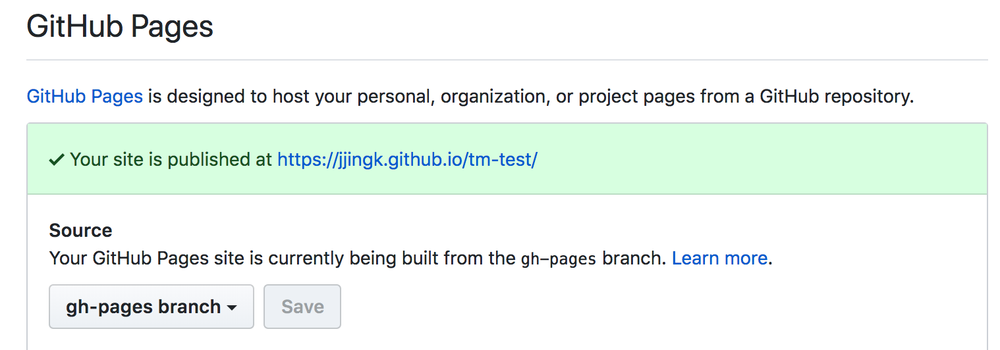

### Github pages subfolder deploy 하기

github 소스를 보면 gh-pages 라는 branch 를 보는 경우가 종종 있었는데 팀 스터디에서 subfolder를 발행하는 팁을 얻으면서 궁금증이 해소 되었음 
tm-test 코드는 아직 정리 할 게 많으나 우선 시도해보았다 

- subtree 명령어를 통해 subfolder 와 branch명을 명시

git subtree push --prefix dist origin gh-pages
git subtree push --prefix [subfolder_name] origin [branchname]


- github 저장소 settings 설정에 가서 발행할 브랜치 설정

- sub path로 발행 완료 [테스트 코드링크](https://jjingK.github.io/tm-test)

### 참고 자료
- [https://gist.github.com/cobyism/4730490](https://gist.github.com/cobyism/4730490)
